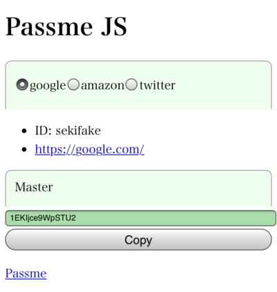

Javascript version
=======================

Sometimes you want to get password from your mobile devices when you do not have access to your PC. For such situation, you can prepare a html file which can generate the password identical to the passme command. Such html file can be generated by

.. code-block:: bash

 passme html

You first enter the filename of the html file. After that you specify the site names to be included in the html file. You can specify ALL to include everything, or you can select some sites which you think you will need to access from your mobile device. The created html file is like this.

You first select the site name from the radio button. Then you enter the master password in the **Master** box. The password is generated every time you type the master password. The generated password can be copied to clipboard with the **Copy** button.

You can send this html file to your mobile device, for example by using Dropbox, and open the html file on your mobile.

Please note that character **ans95** does not work on Javascript version.

----

Toppage_

.. _Toppage: README.rst
