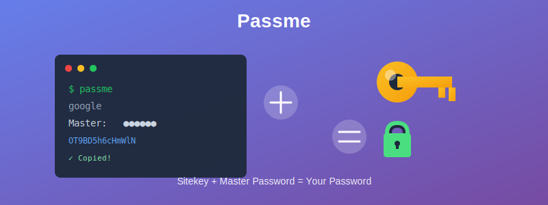

# Passme: Password management with command line

**Passme** is a password management tool that works via the command line or a [web browser](passme.html). It helps you generate strong, unique passwords for many sites. 



Passme generates a password deterministically every time using a site-specific seed (**sitekey**) stored in a configuration file ([sitekey file](sitekey/)) combined with a **master password** that you memorize.

> **Sitekey + Master password = Password**

Since the master password is not site-specific, you only need to remember **one** master password.

### Key Features

*   **Stateless:** No encrypted password vault to manage or sync.
*   **Secure:** The master password is never stored on disk.
*   **Vendor Independent:** Uses open, standard algorithms. Even if Passme software is no longer supported, you can recover your passwords using the known calculation logic (no lock-in).

**Critical Security Warning:** 
*   **Do not forget your master password.**
*   **Do not lose your sitekey file.**

If you lose either of them, you will lose access to all your passwords and cannot recover them. This "non-recoverability" is what makes the system secure (no backdoor). The sitekey file should be backed up securely, for example, in a private git repository.

Refer to [Security](security/) for more detailed information.

### Install

See the [Install](install/) page.

### Preparation of sitekey file

At first run, invoke `passme` and enter the filename where you want to save your site keys.

```bash
> passme
Filename to save site keys:
```

Refer to [Sitekey file](sitekey/) for more information.

### Create a new sitekey

You can create a sitekey for a new site using the `passme add` command:

```bash
> passme add
Site name: google
Character (an): 
Password length (14): 
Comment (no input to finish): 
```

Refer to [Passme add command](add/) for more information.

### Generate password

After creating the sitekey, generate the password for a site by running:

```bash
> passme site [master]
```

Where:
*   `site`: The site name.
*   `master`: Your master password.

If the master password is not provided in the command line, you will be prompted for it. Providing it in the command line is generally discouraged as it may be saved in your command history (e.g., `.bash_history`).

Refer to [Generate password](genpass/) for more information.

### List of site names

To see a list of all site names currently in your sitekey file:

```bash
> passme list
```

### Use functions from Python

You can import `passme` as a Python module and use its two main functions: `readpass` and `genpass`.

*   `passme.readpass(site, master)`
    *   `site`: Site name
    *   `master`: Master password

*   `passme.genpass(seed, hash, char, len)`
    *   Arguments correspond to the algorithm parameters explained in the [Security](security/) section.

### Test calculation

You can test the calculation routine to ensure consistency. The following command compares all available hash algorithms and character types against expected results. This verifies that the program works correctly in your environment.

```bash
> passme test
Test completed without error.
```

### More information

*   [Edit the sitekey file](edit/) with the `passme edit` command.
*   [Changing the password](change/).
*   [Javascript version](javascript/) for generating passwords on mobile devices.
*   [Configuration](config/) via the `.passme` file.
*   [Multiple accounts](multiaccount/) on the same site.
*   [Security](security/).

### History

Since its [public release](https://pypi.org/project/passme/#history) in 2017, the author has migrated from existing password management systems to Passme and has been using it securely through 2025. Currently, over 100 site passwords are managed using this tool.

### Author

[Katsutoshi Seki](https://github.com/sekika) wrote this software and published it under the [MIT license](../LICENSE.txt). The author's email address is available in [this paper](https://dx.doi.org/10.1016/j.geoderma.2015.02.013).
